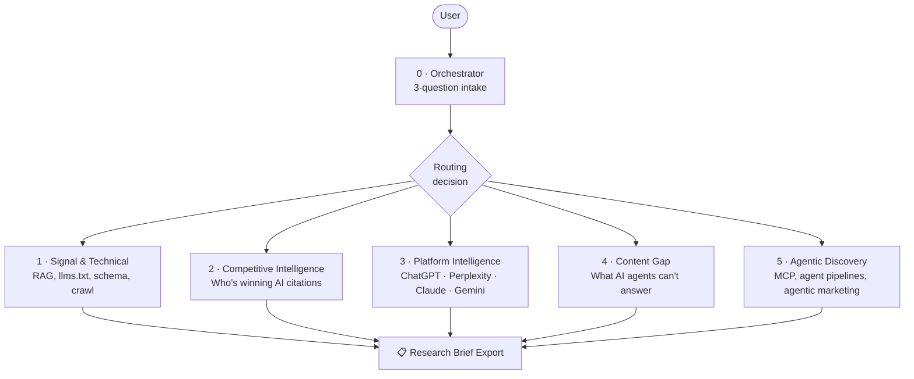

# AEO/GEO Researcher

**A six-specialist AI research system for AEO, GEO, SOM, RAG, and Agentic Marketing.**

[](https://usedcolouringbook.github.io/aeo-geo-researcher/)
[](LICENSE)
[](https://clief.substack.com)

---

## What This Is

An investigative research partner for the practice of getting content found, retrieved, and cited by AI answer systems and AI agents.

Drop this folder into a Claude project or open it as a Claude Code directory. Describe your situation to the Orchestrator. It runs a short intake, then **sharpens your question against known failure patterns** — surfacing the better question you didn't know to ask ("did you mean *cited in the answer* or *recommended as a vendor*? Those are different pipelines") and letting you confirm — before any specialist engages. Specialists then investigate by branching on what they find, not by running a fixed checklist. Research is tagged on two axes — verification (`confirmed / unconfirmed / emerging`) and source credibility (`T1`–`T5`) — so a finding's certainty and the trustworthiness of its source are always visible. Every session ends with a gap identified and a concrete next move.

Specialists draw from a shared reference library covering RAG architecture (16 types), GEO content frameworks (backed by ACM SIGKDD 2024 research), per-platform citation mechanics with quantified thresholds, a structured 5-category AEO audit protocol, and the full agentic marketing stack including MCP.

Sessions run a three-step pipeline: a rapid **Signal Scan** identifies the highest-priority angle, a **Deep Investigation** by the right specialist produces findings, and a **Source Audit** runs an adversarial challenge on those findings before the client acts. Every finding carries a citation fabrication rule — a statistic that can't be traced to a named source at a named tier is a hypothesis, not a finding.

**It researches. It does not summarize.**

---

## Architecture



---

## Quick Start

Two optimized packages — choose the one that matches how you work.

### Claude Projects (web) → use `claude-projects/`

1. Create a new Claude project at claude.ai
2. Open project settings → **Project Instructions** — paste the full contents of `claude-projects/INSTRUCTIONS.md`
3. Upload everything else in `claude-projects/` to the **Knowledge Base**
4. Start a chat: describe your situation to the Orchestrator

The `claude-projects/` package puts the Orchestrator in the priority-loaded Project Instructions layer and the specialists + reference library in the Knowledge Base — clean context separation optimized for the Projects environment.

### Claude Code (terminal) → use this folder

1. Open this folder as your project directory: `claude` from inside `aeo-geo-researcher/`
2. Start a chat: describe your situation to the Orchestrator
3. At session end, the AI writes `references/scripts/brief.yaml` — run `python references/scripts/generate_report.py` to open your research brief

---

## Example Session

**User:** I run a B2B SaaS product for mid-market HR teams. We're not appearing in AI answers when people search for HR software recommendations.

**Orchestrator:** Quick intake first. What do you already know about this — have you checked anything technical, or looked at who *is* getting recommended? And what sources have you reviewed so far?

**User:** Nothing technical. We just notice we're never mentioned. Haven't reviewed anything.

**Orchestrator (reframe):** One distinction worth pinning down, because it changes where we look. "Not appearing in AI answers" usually means one of three things: **access** — the AI's crawler can't reach or index you; **authority** — it reaches you but doesn't trust you enough to cite; or **presence** — the platform isn't triggering AI recommendations for HR-software queries at all. They have completely different fixes. Does one of those match what you're seeing, or is that exactly what you need me to find out?

**User:** I genuinely don't know — that's what I need to find out. But start with whether they can even reach us.

> *The vague "not appearing" is sharpened to an access-first investigation — a framing the user wouldn't have drawn unprompted. The Orchestrator routes the sharpened angle to Signal & Technical, gaps flagged (no technical audit, no competitor names, no sources reviewed).*

**Signal & Technical:** We'll diagnose the ChatGPT pipeline first — Bing-indexed, crawled by OAI-SearchBot. Can I work from your public site, or do you have Search Console access?

**User:** Public site only.

**Signal & Technical (branching — access gates everything):**

**Pivot 1 — Access.** `robots.txt` blocks GPTBot and OAI-SearchBot. `confirmed · T2 · critical`
This is the root cause: ChatGPT's retrieval pipeline cannot reach your site. *Before we go further — no schema or content fix changes anything until this clears. This is fix #1. I'll keep mapping for the full picture.*

**Pivot 2 — Indexation.** `site:yourdomain.com` on Bing returns 0 results. `confirmed · T2 · critical`
The second gate. ChatGPT's live retrieval is Bing-powered; a site not in Bing can't be cited regardless of content quality. Access + indexation together fully explain the non-appearance — so legibility below is downstream, not the cause.

**Pivot 3 — Legibility (downstream of the gates):**
- **llms.txt** — 404. `confirmed · T2 · medium` — missing for Perplexity citation prioritization; not a confirmed ChatGPT factor.
- **Schema** — none detected via raw-source check. `unconfirmed · T2 · high` — verify at validator.schema.org before acting (my own fetch strips JSON-LD).

**Gap:** Cannot assess crawl budget, index coverage, or Core Web Vitals without Search Console access.

**Next research move:** Unblock OAI-SearchBot in robots.txt, then re-run the Bing `site:` check in 48 hours — if pages appear, the access fix worked and indexation is recovering; if not, submit the sitemap via Bing Webmaster Tools.

---

## Reference Library

Specialists draw from a shared `references/specialist-info/` knowledge base. The full index is at `references/specialist-info/INDEX.md`.

| Reference | Covers |
|---|---|
| `aeo-geo-signals.md` | RAG pipeline, chunking, llms.txt, schema, crawl signals, monitoring, SoM |
| `aeo-audit-checklist.md` | 5-category audit protocol: crawlability → schema → content → authority → monitoring |
| `geo-content-framework.md` | GEO content structure, Answer Capsule framework, citation readiness scorecard, GEO-Bench research |
| `platform-behaviors.md` | Per-platform mechanics with quantified thresholds; Google AI Mode; off-site authority |
| `rag-taxonomy.md` | 16 RAG types, decision framework, evaluation metrics, frameworks ecosystem |
| `agentic-patterns.md` | MCP, agent pipelines, agentic vs retrieval distinction |
| `source-credibility.md` | T1–T5 credibility tiers; all findings cite tier + verification status |
| `glossary.md` | Domain terminology |

---

## Specialist Directory

| # | Specialist | Research domain | When the Orchestrator routes here |
|---|---|---|---|
| 0 | Orchestrator | Intake + routing | Always first |
| 1 | Signal & Technical | RAG mechanics, llms.txt, schema, crawl signals | Technical foundations unknown or broken |
| 2 | Competitive Intelligence | Who's winning AI citations and why | Competitive landscape is the question |
| 3 | Platform Intelligence | ChatGPT, Perplexity, Claude, Gemini behavior | Platform-specific behavior matters |
| 4 | Content Gap | What content AI agents can't answer | Content strategy (after technical confirmed) |
| 5 | Agentic Discovery | MCP, agent pipelines, agentic marketing | AI agents taking actions, not just finding content |

---

## Research Brief Export

At the end of a session, request a research brief. The AI produces a structured, audit-style deliverable:

**Executive Summary → Signal Legend → Findings by Domain → Priority Matrix → Gap Map → Next Research Move**

### Claude Projects
The AI outputs the brief as formatted markdown in conversation. Say "Give me the HTML export" — the AI generates the full HTML file inline. Save as `.html`, open in browser, export PDF.

### Claude Code
The AI writes `references/scripts/brief.yaml`. Run:
```bash
python references/scripts/generate_report.py
```
The report opens in your browser automatically. Print or export to PDF.

---

## Built With

Built using Interpretable Context Methodology (ICM) — filesystem structure encodes workflow, routing documents replace orchestration.

Submitted to Clief Notes Weekly Competition #6: The Researcher.

<!-- Swap <GH_USER> for the real GitHub username/org at submission. -->
[Full documentation ->](https://usedcolouringbook.github.io/aeo-geo-researcher/)
